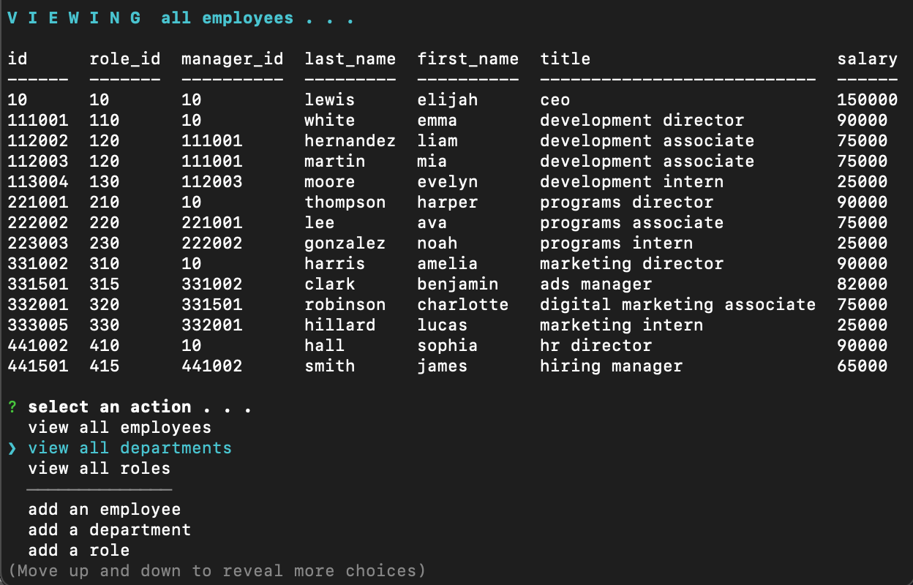

# Employee_Tracker

## Description
- The command line application is a content management system which allows for the management of a hypothetical company's employees
- This application utilizes Inquirer and a MySql database comprised of three tables to return queries the user makes
- The application is able to perform the following:
	- View all employees, view employees by department, view employees by role
	- Add employees, departments, or roles
	- Update employees
	- Delete employees

### The User Story for this project is as follows:
- As a business owner, I want to be able to view and manage the departments, roles, and employees in my company, So that I can organize and plan my business

### Installation
- The project is uploaded to [GitHub](https://github.com/) at the following repository: [here](https://github.com/sourslaw/Employee_Tracker)

### Usage

### Credits
- [chalk](https://www.npmjs.com/package/chalk)
- [console.table](https://www.npmjs.com/package/console.table)
- [Inquirer.js](https://www.npmjs.com/package/inquirer/v/0.2.3)
- [mysql](https://www.npmjs.com/package/mysql)

### License
- Licensed under the [MIT](https://opensource.org/licenses/mit-license.php) license.